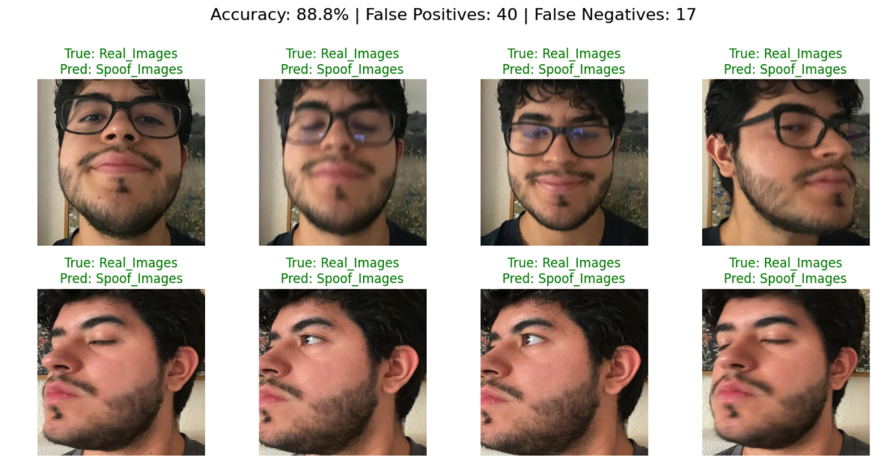
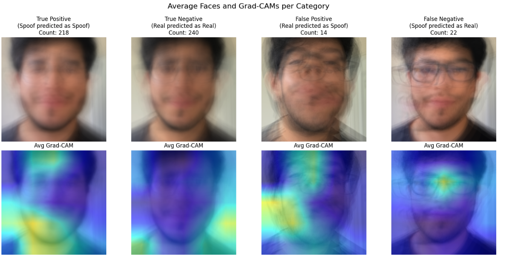

# Face ID Spoofing Detector

## Project Overview

* **Situation:** Facial recognition systems like Face ID need a guardrail against video replays where an attacker holds up a digital screen playing a recording of the authorized user.
* **Task:** Build a robust Convolutional Neural Network (CNN) model capable of successfully distinguishing between real human faces and video replay spoof attacks.
* **Action:** Compiled a custom dataset using 10+ 20-second video recordings of my face from various angles, representing both "real" captures and "spoof" (video replay) scenarios.The faces were extracted and normalized to 224x224 pixels using **MediaPipe's BlazeFace Short Range** model. For the core classifier, I adapted and fine-tuned a pre-trained **InceptionResnetV1** model (via `facenet-pytorch`, originally trained on VGGFace2). Training in PyTorch involved a two-stage approach: initially freezing the backbone to train a custom binary classification head, followed by unfreezing the final convolutional blocks to fine-tune the model to detect subtle screen artifacts.

## Usage

### To Run the Demo
1. Extract the dataset by unzipping `demo.zip`.
2. Open `Demo_spoof_detector.ipynb` in **Google Colab**.
3. Connect to the Colab runtime and upload the pre-trained model (`model.pt`) and the dataset (`Demo_Dataset.zip`) to the `/content` directory (Colab's default directory).
4. Once both files are uploaded, select **Run All** in the Colab menu.

### To Run the Training Code (Includes Grad-CAM Visualization)
1. Open `training_spoof_detector.ipynb` in **Google Colab**.
2. Connect to a High-RAM GPU runtime (e.g., **GPU L4**).
3. Upload the full training dataset `Dataset_Spoof_Detector.zip` to the `/content` directory.
4. Select **Run All**. 
   *Note: The script may need to uninstall some existing Colab packages and install specific PyTorch versions. If a prompt appears asking to restart the session, click **Restart Session** and select **Run All** again.*

## Results

### Model Accuracy & Error Analysis

This image presents the model's overall evaluation metrics alongside a grid of misclassifications, detailing the False Positives and False Negatives. By visually inspecting where the model failed, we gain insight into its limitations—such as extreme lighting conditions or peculiar face angles. This error analysis demonstrates not only a high accuracy(88.8%) but also helps pinpoint the precise conditions under which distinguishing between a physical face and a digital screen becomes ambiguous.

### Grad-CAM Visualization

This visualization uses Gradient-weighted Class Activation Mapping (Grad-CAM) applied to the final convolutional block of the InceptionResnetV1. It highlights via heatmaps the specific regions of the input images that most strongly influenced the model's predictions. By reviewing the average Grad-CAMs across True Positives, True Negatives, False Positives, and False Negatives, we can confirm that the network learned genuine spoofing indicators—such as screen borders, pixel grids, or display reflections—rather than improperly overfitting to irrelevant background details.